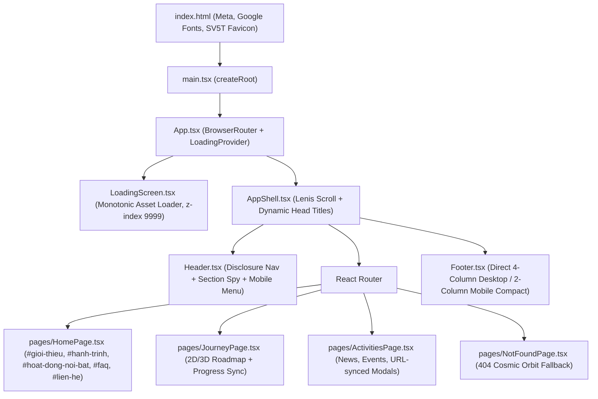
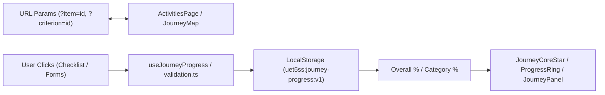

# PROJECT CONTEXT — 5SS UET WEBSITE

> **Document Purpose**: This file serves as the definitive single-source technical context for AI agents and engineers working on the 5SS UET codebase. Any new AI agent can read this document to understand the full system architecture, dependencies, data flows, 3D scenes, styling contracts, and development rules without needing to rescan the entire repository.

---

## 1. Project Overview

- **Name**: 5SS UET — Website Câu lạc bộ Sinh viên 5 Tốt, Trường Đại học Công nghệ – ĐHQGHN (VNU University of Engineering and Technology).
- **Core Purpose**: Digital brand space and interactive cosmic roadmap ("5SS Galaxy – Hành trình tỏa sáng") guiding students through the 5 criteria of the "Sinh viên 5 Tốt" movement:
  1. Đạo đức tốt (Ethics & Morality)
  2. Học tập tốt (Academic & Research)
  3. Thể lực tốt (Physical Fitness)
  4. Tình nguyện tốt (Volunteering & Community)
  5. Hội nhập tốt (Integration & Global Mindset)
- **Target Audience**: University students (primarily UET/VNU), prospective club members, university youth union reviewers, and student activity organizers.
- **Operating Model**: Client-side single-page web app (SPA) with mock/demo features for activity registration, contact forms, and client-persistent checklist tracking via browser LocalStorage.

---

## 2. Tech Stack

- **Runtime & Build Tooling**: Vite 8.2.2 + Rolldown/ESBuild + TypeScript 6.0.2 (`tsc -b --pretty false`).
- **Core Framework**: React 19.2.8 + React DOM 19.2.8 (mounted directly with `createRoot`; `StrictMode` is not enabled in the current entry point).
- **Routing**: React Router 7.18.3 (`BrowserRouter`, `Routes`, `Route`, `NavLink`, `useLocation`, `useNavigate`, `useSearchParams`).
- **Styling**: Tailwind CSS v4.3.3 (`@tailwindcss/vite` plugin) + Custom 8-layer CSS Architecture (`index.css` cascade contract).
- **Animation & Motion**: Motion 13.1.1 (`motion/react`, `AnimatePresence`, `useReducedMotion`).
- **Inertial Smooth Scrolling**: Lenis 1.3.26 (`lenis/dist/lenis.css`, bound to `window.__lenis`).
- **3D & WebGL Graphics**:
  - Three.js 0.180.0
  - React Three Fiber 9.7.0 (`@react-three/fiber`)
  - React Three Drei 10.7.8 (`@react-three/drei`)
- **Icons**: Lucide React 1.37.0 (`lucide-react`).
- **Linting & Code Quality**: Oxlint 1.79.0 (`.oxlintrc.json`).
- **Deployment Target**: Vercel (`vercel.json` SPA rewrite rule `/(.*) -> /index.html`).

---

## 3. Project Architecture

The application is structured as a component-driven React Single Page Application (SPA) with a strict top-down layout and lifecycle pipeline:



### Key Architectural Layers:
1. **Context & Transition Layer**: `LoadingContext` coordinates between `LoadingScreen` asset preloading and staged hero element appearance via `startHeroReveal()` and `completeLoading()`.
2. **Layout Shell**: `AppShell` runs the global Lenis RAF scroll loop, updates route metadata/title, moves focus to `#main-content` after route changes, and orchestrates smooth hash scrolling. Hash navigation is owned by React Router; `AppShell` refreshes Lenis measurements before cross-route anchor scrolling.
3. **Section Modules (`src/sections/`)**: Composable view slices for the homepage (`Hero`, `About`, `Criteria`, `Activities`, `Faq`, `Contact`).
4. **Interactive Feature Modules (`src/features/`)**: Self-contained stateful domains (`journey/`, `forms/`, `activities/`).
5. **3D Scenes (`src/three/scenes/`)**: WebGL R3F canvases decoupled from business logic with viewport intersection pause and mobile performance throttling.
6. **Data & Config Layer (`src/data/`, `src/config/`)**: Immutable typed content models, navigation routes, contact specs, and criteria criteria/checklists.

---

## 4. Folder Structure

```text
5SS website/
├── public/
│   ├── assets/
│   │   ├── sv5t-mark.png           # Official S-mark logo with soft gold + blue-cyan gradient (v=2)
│   │   └── sv5t-mark-original.png  # Clean backup of original vector asset
│   ├── og-5ss-v2.png               # Social share preview (1730x909px)
│   └── og.png                      # Legacy social share preview
├── src/
│   ├── assets/
│   │   ├── hero.png                # Hero visual asset / fallback poster
│   │   └── SV5T.svg                # 4-organization emblem strip for marquee
│   ├── components/
│   │   ├── layout/
│   │   │   ├── AppShell.tsx        # Shell wrapper: Lenis scroll, route titles, anchor scroll
│   │   │   ├── Footer.tsx          # Direct 4-col desktop / 2-col mobile footer with back-to-top
│   │   │   └── Header.tsx          # Top nav: Logo, Giới thiệu, Routes, Explore dropdown, CTA
│   │   ├── loading/
│   │   │   ├── LoadingScreen.tsx   # Intro loader: monotonic progression, fonts/image preloader
│   │   │   └── LoadingStarPentagon.tsx # 5-star geometric SVG constellation animation
│   │   └── ui/
│   │       ├── AccessibleModal.tsx # ARIA modal dialog with focus trap & Escape listener
│   │       ├── AffiliationMarquee.tsx # Infinite marquee banner for student organizations
│   │       ├── BackgroundOrbs.tsx  # Ambient floating background orbs
│   │       ├── BrandMark.tsx       # Logo + text mark component
│   │       ├── GlassCard.tsx       # Reusable glassmorphic container
│   │       ├── MediaPlaceholder.tsx# Image fallback placeholder with subtle shimmer
│   │       ├── MouseGlow.tsx       # Desktop-only cursor-following radial glow
│   │       ├── PageIntro.tsx       # Consistent sub-page header with eyebrow & description
│   │       ├── ScrollReveal.tsx    # IntersectionObserver-based Framer reveal wrapper
│   │       └── Toast.tsx           # Floating feedback notification
│   ├── config/
│   │   ├── contact.ts              # Social links, campus address, meeting location
│   │   └── site.ts                 # Brand strings, navigation hierarchy, breadcrumbs, CTA
│   ├── context/
│   │   └── LoadingContext.tsx      # Loading & staged hero reveal coordinator
│   ├── data/
│   │   ├── about.ts                # Mission, values, executive board/leadership data
│   │   ├── activities.ts           # News, workshops, highlight events data
│   │   ├── faq.ts                  # Frequently asked questions list
│   │   └── journey.ts              # 5 criteria definitions, conditions, roadmap, checklists
│   ├── features/
│   │   ├── activities/
│   │   │   └── RegistrationForm.tsx # Modal form for event registration (mock)
│   │   ├── forms/
│   │   │   ├── ContactForm.tsx     # Message form on contact section
│   │   │   └── validation.ts       # Email regex and required field helpers
│   │   ├── journey/
│   │   │   ├── JourneyConstellation.tsx # Desktop 2D interactive constellation canvas
│   │   │   ├── JourneyCoreStar.tsx # Center 5SS star widget with overall progress %
│   │   │   ├── JourneyMap.tsx      # Journey state orchestrator (URL sync + toast timer)
│   │   │   ├── JourneyMobileTrack.tsx # Mobile vertical track for narrow screens
│   │   │   ├── JourneyPanel.tsx    # Detail accordion panel with roadmap & checklist (keyed)
│   │   │   ├── ProgressRing.tsx    # Circular SVG progress gauge
│   │   │   ├── journeyCoordinates.ts # 1000x640 normalized geometry coordinate map
│   │   │   └── useJourneyProgress.ts # LocalStorage state persistence hook
│   │   └── shared/
│   │       └── useMediaQuery.ts    # React media query listener hook
│   ├── hooks/
│   │   ├── useIsMobile.ts          # Window matchMedia hook for 768px CSS breakpoint sync
│   │   ├── useMousePosition.ts     # Client mouse tracking hook
│   │   ├── useReducedMotion.ts     # prefers-reduced-motion OS accessibility listener
│   │   └── useScrollProgress.ts    # Window scroll progress calculation
│   ├── pages/
│   │   ├── ActivitiesPage.tsx      # Activity list + query-param URL modal sync (?item=id) + Empty state
│   │   ├── HomePage.tsx            # Main composite landing page
│   │   ├── JourneyPage.tsx         # 5 criteria roadmap page
│   │   └── NotFoundPage.tsx        # 404 error page
│   ├── sections/
│   │   ├── About/AboutSection.tsx  # Mission, values, club leadership
│   │   ├── Activities/ActivitiesSection.tsx # Homepage news & event highlights
│   │   ├── Contact/ContactSection.tsx # Contact channels, address, message form
│   │   ├── Criteria/CriteriaSection.tsx # 3D Criteria Constellation stage + criteria info
│   │   ├── Faq/FaqSection.tsx      # Accordion FAQ section
│   │   └── Hero/HeroSection.tsx    # 3D Galaxy scene, slogan, orbit tags, CTAs
│   ├── styles/
│   │   ├── animations.css          # Keyframes: orbit, pulse, shimmer, marquee
│   │   ├── components.css          # Base buttons, badges, modals, cards, inputs
│   │   ├── journey.css             # Constellation map, node bodies, checklist styling
│   │   ├── pages.css               # Specific page-level layout rules
│   │   ├── responsive.css          # Mobile & tablet media queries (320px to 1024px)
│   │   ├── theme-5ss.css           # Bright Dreamy Cosmic theme, header, footer, glass rules
│   │   └── tokens.css              # Design tokens: colors, gradients, radiuses, glows
│   ├── three/
│   │   └── scenes/
│   │       ├── Criteria3DScene.tsx # 3D rotating criteria pentagon with offscreen pause
│   │       └── HeroGalaxyScene.tsx # 3D hero galaxy scene with core star & orbit ring
│   ├── utils/
│   │   └── navigation.ts           # Unified anchor scrolling & Lenis navigation helper
│   ├── App.tsx                     # Top-level route switch & loading wrapper
│   ├── index.css                   # Master stylesheet import cascade
│   └── main.tsx                    # React entry point
├── .oxlintrc.json                  # Oxlint configuration
├── index.html                      # HTML root template with fonts & metadata
├── package.json                    # Dependencies & build scripts
├── tsconfig.app.json               # TypeScript app config (strict)
├── tsconfig.json                   # Solution root tsconfig
├── tsconfig.node.json              # Node tsconfig for Vite
├── vercel.json                     # Vercel SPA routing rewrite
└── vite.config.ts                  # Vite + Tailwind + Rolldown chunk splitting config
```

---

## 5. Application Flow

1. **Initialization (`main.tsx` $\rightarrow$ `App.tsx`)**:
   - `LoadingProvider` starts each full document load with `isLoaded = false`, so the short cinematic loader replays after F5 or opening the site in a new tab. Client-side route changes do not remount the provider and therefore do not replay the loader.
   - During a full page load, `LoadingScreen` renders as a fixed overlay (`z-index: 9999`) while the application shell is `inert` and hidden from assistive technology.
2. **Asset & Readiness Preloading**:
   - `LoadingScreen` checks `document.fonts.ready` and preloads `/assets/sv5t-mark.png?v=2`.
   - R3F asset progress from `@react-three/drei`'s `useProgress()` is tracked.
   - Progress increments monotonically ($0 \rightarrow 100\%$) with a 900ms minimum intro (250ms reduced-motion) and a hard asset-readiness deadline of 1400ms (450ms reduced-motion), preventing fonts or WebGL readiness from blocking access indefinitely.
3. **Cinematic Handoff & Hero Reveal**:
   - Upon hitting $100\%$, an anticipation charge of 140ms occurs, followed by a 280ms exit transition.
   - `startHeroReveal()` triggers Navbar entrance and Hero typography floating animations.
   - `LoadingScreen` fades out and calls `completeLoading()`, unmounting from the DOM.
4. **Runtime User Interactions**:
   - **Lenis Smooth Scroll**: Mouse wheel and anchor clicks scroll smoothly with offset compensation. Before a cross-route hash scroll, `AppShell` calls `lenis.resize()` so the target is not clamped to the previous route's shorter scroll limit.
   - **Section Spy**: `IntersectionObserver` on `#gioi-thieu`, `#hanh-trinh`, `#hoat-dong-noi-bat`, `#faq`, and `#lien-he` updates navigation highlight visually without pushing history.
   - **Journey Map Tracking**: User clicks a node to view criteria details; checking checklist items updates LocalStorage immediately and refreshes the overall progress ring.
   - **Activities Deep Linking**: Clicking a news/event card updates URL query to `?item=news-1`. The modal opens; pressing Browser Back closes the modal without reloading.

---

## 6. Routing & Pages

| Route Path | Page Component | Description |
| :--- | :--- | :--- |
| `/` | `HomePage` | Composite landing page containing Hero 3D, About, Criteria 3D, Activities, FAQ, Contact. |
| `/hanh-trinh-5-tot` | `JourneyPage` | Comprehensive 5 criteria gamified roadmap with desktop 2D constellation & mobile vertical track. |
| `/hoat-dong` | `ActivitiesPage` | News/event archive with two tabs (`Tin tức`, `Sự kiện`), event status filters (`Tất cả`, `Sắp diễn ra`, `Đã kết thúc`), Empty State fallback, and URL modal sync (`?item=id`). |
| `*` | `NotFoundPage` | 404 Cosmic Orbit Error Page with route return button. |

### Anchor Links on Homepage:
- `/#gioi-thieu`: About Section (Sứ mệnh, Giá trị cốt lõi, Ban chủ nhiệm)
- `/#hanh-trinh`: Criteria Section (5 tiêu chí)
- `/#hoat-dong-noi-bat`: Activities Section
- `/#faq`: FAQ Section
- `/#lien-he`: Contact & Simulation Message Form

---

## 7. Components & Component Hierarchy

### Core Layout Components
- **`Header`**: Top navbar. Contains brand mark, top-level "Giới thiệu" anchor, primary route links ("Hành trình 5 Tốt", "Hoạt động"), "Khám phá" disclosure dropdown (FAQ, Liên hệ), and action CTA. Responsive disclosure hamburger on mobile.
- **`Footer`**: Direct 4-column desktop grid (`1.8fr 1fr 1.25fr 1.35fr`) with bounded logo ($44 \times 44$px), notice card for unannounced socials, and back-to-top button; 2-column mobile layout.
- **`AppShell`**: Shell wrapper handling route changes, `document.title`, dynamic meta description, Lenis lifecycle, and hash target scrolling.

### UI & Utility Components
- **`AccessibleModal`**: Standardized dialog with `role="dialog"`, `aria-modal="true"`, focus trapping (`tabIndex`), body scroll-lock, and `Escape` key close.
- **`ScrollReveal`**: Motion-based reveal component using `IntersectionObserver` with `framerEase = [0.16, 1, 0.3, 1]`. Automatically disables translation when `prefers-reduced-motion` is active.
- **`AffiliationMarquee`**: Infinite CSS-animated ticker showcasing student association emblems. Each of its two identical animation cycles contains three logo-strip copies and uses one shared responsive gap token, keeping the loop filled and the seam evenly spaced.
- **`PageIntro`**: Uniform page banner with gradient title, eyebrow tag, and metadata badges.
- **`Toast`**: Transient bottom-center notification with timer collision protection.

### Feature Subsystems
- **`JourneyMap`**: Root state orchestrator for the criteria roadmap. Renders `JourneyConstellation` on desktop ($\ge 769$px) or `JourneyMobileTrack` on mobile ($\le 768$px) alongside `JourneyPanel` (keyed by `criterion.id` for clean unmount/remount state reset).
- **`JourneyPanel`**: Criteria detail sidebar containing definition, conditions, club support, roadmap steps, checklist, and action CTAs.
- **`ContactForm`**: Simulated contact submission form with live validation (`name`, `email`, `message`).
- **`RegistrationForm`**: Modal event signup form with client validation.

---

## 8. State & Data Flow



1. **Single Source of Truth for Modals**: `searchParams.get('item')` controls modal visibility in `ActivitiesPage.tsx`. Modals are mutually exclusive (News vs. Event).
2. **Single Source of Truth for Journey Progress**: `useJourneyProgress.ts` synchronizes checklist toggles with `localStorage.getItem('uet5ss:journey-progress:v1')`. All percentage metrics are derived in pure `useMemo`.
3. **No External Global State Library**: The project intentionally avoids Redux/Zustand overhead, relying on React Context (`LoadingContext`), React Router (`useSearchParams`), custom hooks, and native browser storage.

---

## 9. Styling & Design System

### The 8-Layer CSS Cascade Contract (`src/index.css`)
Order matters strictly:
1. `@import "tailwindcss";`
2. `@import "./styles/tokens.css";` (CSS Variables)
3. `@import "./styles/animations.css";` (Keyframe definitions)
4. `@import "./styles/components.css";` (Base cards, buttons, badges)
5. `@import "./styles/pages.css";` (Page container constraints)
6. `@import "./styles/journey.css";` (Constellation map, node bodies, checklist styling)
7. `@import "./styles/theme-5ss.css";` (Bright Dreamy Cosmic color theme overrides)
8. `@import "./styles/responsive.css";` (Breakpoint overrides, 320px to 1024px)

### Design Tokens & Palette:
- **Base Background**: Deep Cobalt Navy (`--bg: #0b234d`, `--bg-elevated: #12356b`).
- **Primary Accent**: University Blue (`#2F7BD8`, `#55A8E8`) + Sky Cyan (`#75CFE5`, `#6CD5F7`).
- **Warm Highlights**: Soft Sun Gold (`#FFD86A`, `#FFE38A`, `#FFD45A`).
- **Text Palette**: Crisp White (`#ffffff`), Cloud Muted (`#b6def5`), Dim Slate (`#86b8db`).
- **5 Criteria Identity Colors**:
  1. Đạo đức: Warm Sun Gold (`#ffd467`)
  2. Học tập: Sky Cyan (`#6cd5f7`)
  3. Thể lực: Mint Spring Green (`#5fe3a1`)
  4. Tình nguyện: Coral Orange (`#ff8b72`)
  5. Hội nhập: Lavender Violet (`#b794f6`)
- **Typography**:
  - Headings: `"Baloo 2", "Be Vietnam Pro", sans-serif`
  - Body: `"Be Vietnam Pro", Inter, sans-serif`
- **Responsive Breakpoint Standard**: Mobile boundary is strictly **`768px`** (matches `@media (max-width: 768px)` in CSS and `useIsMobile(768)` in JS).

---

## 10. 3D & Animation Architecture

### Three.js Scenes (`src/three/scenes/`)
1. **`HeroGalaxyScene.tsx`**:
   - **Camera**: Perspective camera at `position: [0, 0, 5.2]` desktop / `5.8` mobile, with `fov: 46` desktop / `52` mobile.
   - **Objects**: Extruded 3D glossy physical star (`CentralStar`), glowing octahedron core diamond, ambient particle field (`Stars`, `Sparkles`), orbiting criteria labels.
   - **Interaction**: Mouse parallax via `PointerRig` with `THREE.MathUtils.damp`.
   - **Optimization**: Visibility tracked via `IntersectionObserver`. When offscreen or in reduced-motion mode, `frameloop` flips to `"demand"`, halting GPU RAF execution. `PerformanceMonitor` can lower DPR to `1` and raise it to `1.5`; mobile reduces particles and disables antialiasing. Desktop uses a small CSS canvas overscan plus aspect-aware assembly scaling so projected orbit halos remain inside the WebGL drawing buffer at narrow two-column widths.
2. **`Criteria3DScene.tsx`**:
   - **Camera**: Perspective camera at `position: [0, 0, 4.4]` desktop / `4.8` mobile, with `fov: 46` desktop / `50` mobile.
   - **Objects**: Rotating pentagon constellation wireframe + 5 criteria sphere nodes + glowing central diamond.
   - **Interaction**: Smooth rotational damping targeting active criterion index (`targetRotationY * 0.45`).
   - **Optimization**: `IntersectionObserver` with `rootMargin: '160px'`. Offscreen `frameloop="demand"`. Mobile renders fewer sparkles (8 vs 18) and lower sphere subdivision (16 vs 24). Includes `CriteriaSceneBoundary` fallback for WebGL-disabled devices.

### Motion Animations
- **Framer Signature Ease**: `[0.16, 1, 0.3, 1]` for smooth, non-bouncy physical transitions.
- **Accessibility**: All infinite rotation loops, particle pulses, blur slides, and forced smooth scroll behaviors automatically disable when `prefers-reduced-motion: reduce` is active.

---

## 11. APIs & External Services

- **Backend Status**: Pure Client-Side Static Website (Serverless).
- **Forms**: `ContactForm` and `RegistrationForm` validate locally and show explicit simulated-success states. They do not send or retain personal data.
- **External Links**:
  - Facebook, TikTok, email, phone, recruitment URL, and UET email domain are intentionally `null` placeholders in config until the CLB confirms official values.
  - The campus address is `144 Xuân Thủy, Cầu Giấy, Hà Nội`; the map remains a styled placeholder because no verified map URL is configured.
  - Fonts: Google Fonts CDN (`Be Vietnam Pro` & `Baloo 2` preconnected in `index.html`).

---

## 12. Important Dependencies

```json
{
  "dependencies": {
    "@react-three/drei": "^10.7.8",
    "@react-three/fiber": "^9.7.0",
    "@react-three/postprocessing": "^3.1.1",
    "lenis": "^1.3.26",
    "lucide-react": "^1.37.0",
    "motion": "^13.1.1",
    "react": "^19.2.8",
    "react-dom": "^19.2.8",
    "react-router-dom": "^7.18.3",
    "three": "^0.180.0"
  },
  "devDependencies": {
    "@tailwindcss/vite": "^4.3.3",
    "@types/node": "^24.13.3",
    "@types/react": "^19.2.18",
    "@types/react-dom": "^19.2.4",
    "@types/three": "^0.180.0",
    "@vitejs/plugin-react": "^6.1.0",
    "oxlint": "^1.79.0",
    "tailwindcss": "^4.3.3",
    "typescript": "~6.0.2",
    "vite": "^8.2.2"
  }
}
```

---

## 13. Configuration & Build Setup

- **`vite.config.ts`**:
  - Plugins: `@vitejs/plugin-react`, `@tailwindcss/vite`.
  - Server: `host: true` (enables testing across LAN/mobile hotspots), `port: 5173`.
  - Rolldown Chunk Splitting: Dedicated chunk groups for `three-core` (maxSize 420KB) and `three-react` (maxSize 420KB) to ensure sub-1s production builds.
- **`tsconfig.app.json`**: Strict TypeScript configuration with `noEmit: true`, `jsx: react-jsx`, and ES2023 target/library.
- **`vercel.json`**: Universal rewrite `/(.*) -> /index.html` to support direct deep linking on refresh.
- **`index.html`**: Preconnects Google Fonts, configures OpenGraph / Twitter cards, sets theme color `#0B234D`, and references favicon `/assets/sv5t-mark.png?v=2`.

---

## 14. Coding Conventions

- **Component Structure**: Named exports for components (`export function Header()`), default export only for root `App.tsx`.
- **Typing**: Strict TypeScript types; avoid `any`. Use `type` or `interface` with clear property documentation.
- **File Naming**:
  - Components/Pages: PascalCase (`JourneyConstellation.tsx`, `HomePage.tsx`).
  - Hooks: camelCase starting with `use` (`useIsMobile.ts`, `useJourneyProgress.ts`).
  - Utils/Data/Config: camelCase (`site.ts`, `journeyCoordinates.ts`, `validation.ts`).
- **Brand Capitalization**: Always use the official title casing: **"Sinh viên 5 Tốt"** and **"Hành trình 5 Tốt"**.
- **Button Token Classes**: Use `.btn .btn--primary` and `.btn .btn--outline` uniformly across all views.
- **No Mock API Side Effects**: When building demo forms, provide honest UI notices ("Bản mô phỏng") rather than deceptive fake server success messages.

---

## 15. Current Implementation Status

- [x] **Header & Navigation**: Top-level "Giới thiệu" anchor + Routes + Disclosure "Khám phá" dropdown + Mobile drawer menu.
- [x] **Loading System**: Monotonic 0–100% loader on every full page load/F5, with a hard readiness deadline, inert background shell, and cinematic hero reveal; client-side route changes do not replay it.
- [x] **Hero Section**: 3D galaxy scene, slogan, interactive orbit labels, responsive composition.
- [x] **About Section**: Mission, 4 core values, club president quote & avatar.
- [x] **Criteria Section**: Real-time 3D constellation stage, stage info card, criteria switcher.
- [x] **Journey Map**: 2D constellation map with normalized coordinate grid (1000x640), mobile vertical track, criterion accordion panel (keyed state), LocalStorage checklist persistence.
- [x] **Activities Page**: Category filter tabs, event status filters (`all`, `upcoming`, `past`), Empty State fallback UI, URL-synced modal sheets (`?item=id`).
- [x] **FAQ & Contact**: Accordion FAQ + honest simulated contact form + university address.
- [x] **Footer**: Direct 4-column desktop / 2-column mobile compact layout.
- [x] **Accessibility (A11y)**: Full reduced-motion support, keyboard focus traps, W3C disclosure navigation.

---

## 16. Important Relationships

```text
Header.tsx ──(depends on)──> site.ts (aboutNavigation, primaryNavigation, exploreNavigation)
                          ──> utils/navigation.ts (navigateToSection, navigateToHomeTop)
                          ──> LoadingContext.tsx (isLoaded, isExiting)

JourneyMap.tsx ──(depends on)──> data/journey.ts (journeyCriteria, journeyStorageKey)
                             ──> journeyCoordinates.ts (JOURNEY_COORDINATES)
                             ──> useJourneyProgress.ts (LocalStorage state)
                             ──> JourneyPanel.tsx (Keyed by criterion.id for clean unmount/remount)
                             ──> useMediaQuery.ts (Breakpoint switcher)

ActivitiesPage.tsx ──(depends on)──> data/activities.ts (newsList, eventsList)
                                 ──> useSearchParams (URL source of truth for modals)

Three.js Scenes ──(depends on)──> useReducedMotion.ts + useIsMobile.ts (frameloop control)
```

---

## 17. Sensitive / High-Impact Areas

1. **`src/styles/theme-5ss.css` & `src/styles/responsive.css`**:
   - Contains delicate responsive calculations, glassmorphism filters, and mobile drawer heights. Do not introduce raw fixed widths or alter base margins without checking mobile 320px–430px viewports.
   - Grid children in the Homepage Criteria experience must keep `min-width: 0`; selected/hover translations are disabled at `max-width: 768px` to avoid clipped content at 320–360px.
2. **`src/features/journey/journeyCoordinates.ts`**:
   - Source of truth for 2D constellation SVG lines, center core star, and planetary node anchor percentages. Changing coordinates here alters both desktop SVG connections and HTML overlay positioning.
3. **`src/components/loading/LoadingScreen.tsx`**:
   - Controls application startup. Any dependency on changing reactive props inside the main loading session loop can cause progress stutters or effect restarting. Maintain ref-based asset tracking.
   - Preserve the hard readiness deadline. The loader intentionally replays on every full document load/F5, but must not replay during ordinary client-side route navigation.
4. **`src/pages/ActivitiesPage.tsx`**:
   - Modal visibility is directly bound to `searchParams`. Ensure bidirectional URL synchronization is preserved when adding new activity items.

---

## 18. Known Issues / Technical Debt

- **`@react-three/postprocessing` Dependency**: Installed in `package.json` but bloom is disabled in current scenes for mobile performance. Kept in dependencies for future shader effects.
- **Form Submissions**: Form handlers currently simulate client-side delivery. When a real backend (e.g. Google Sheets API / Supabase / Express) is integrated, `ContactForm.tsx` and `RegistrationForm.tsx` should be connected via `fetch()` services.
- **Repository Metadata**: Git metadata is currently available; inspect `git status` and preserve unrelated working-tree changes before editing.
- **Lint Warnings**: Oxlint currently reports non-blocking React warnings for effect-driven external-state synchronization and files that export both components and hooks/helpers. TypeScript and production build remain clean; address these only in a dedicated refactor to avoid changing validated UI behavior.

---

## 19. Rules for Future AI Agents

1. **Do Not Break the Visual Identity**: Maintain the **Bright Dreamy Cosmic** art direction (Cool University Blue, Soft Sun Gold, Sky Cyan/Mint, Deep Cobalt background). Do not reintroduce harsh pink/coral dominance or neon yellow fills.
2. **Reuse Existing Components & Helpers**: Use `AccessibleModal` for dialogs, `ScrollReveal` for scroll triggers, and `navigateToSection()` for anchor links. Do not create competing navigation or modal systems.
3. **Preserve Single Sources of Truth**:
   - Navigation links $\rightarrow$ `src/config/site.ts`
   - Criteria data $\rightarrow$ `src/data/journey.ts`
   - Coordinate map $\rightarrow$ `src/features/journey/journeyCoordinates.ts`
   - Address & Contact $\rightarrow$ `src/config/contact.ts`
4. **Respect Reduced Motion**: Always wrap infinite animations or intensive WebGL float rotations with `useReducedMotion()`.
5. **Enforce 768px Breakpoint Consistency**: Always align JavaScript media queries with `@media (max-width: 768px)`.
6. **Verify Before Finishing**: Always execute `npm run typecheck`, `npm run lint`, and `npm run build` after modifications. Ensure 0 errors.

---

## 20. Quick Context for New AI (30-Second Summary)

```text
- Project: 5SS UET (Sinh viên 5 Tốt - VNU University of Engineering & Technology).
- Stack: React 19 + TypeScript + Vite + Tailwind CSS v4 + Motion + Three.js / R3F + Lenis.
- Art Direction: Bright Dreamy Cosmic (Cobalt Blue #0b234d, University Blue #2f7bd8, Soft Gold #ffd467, Cyan #75cfe5).
- Structure: SPA with 4 routes (/, /hanh-trinh-5-tot, /hoat-dong, 404).
- Key Feature 1: 5 Criteria Gamified Journey Map with LocalStorage checklist sync (uet5ss:journey-progress:v1).
- Key Feature 2: 3D Hero Galaxy & 3D Criteria Scene with automatic offscreen frameloop demand throttling.
- Key Feature 3: Deep-linked modal dialogs synced with URL search params (?item=id) + Empty state views.
- Navigation: Desktop header with Logo (Home top), Giới thiệu (/#gioi-thieu), Routes, and Khám phá (FAQ/Contact dropdown).
- Loading: short cinematic intro on every full page load/F5; client-side route changes do not replay it. Background app is inert during the intro.
- Responsive Standard: 768px breakpoint boundary. Zero horizontal scroll on 320px–1920px.
- Build Verification: npm run typecheck && npm run build && npm run lint.
```
